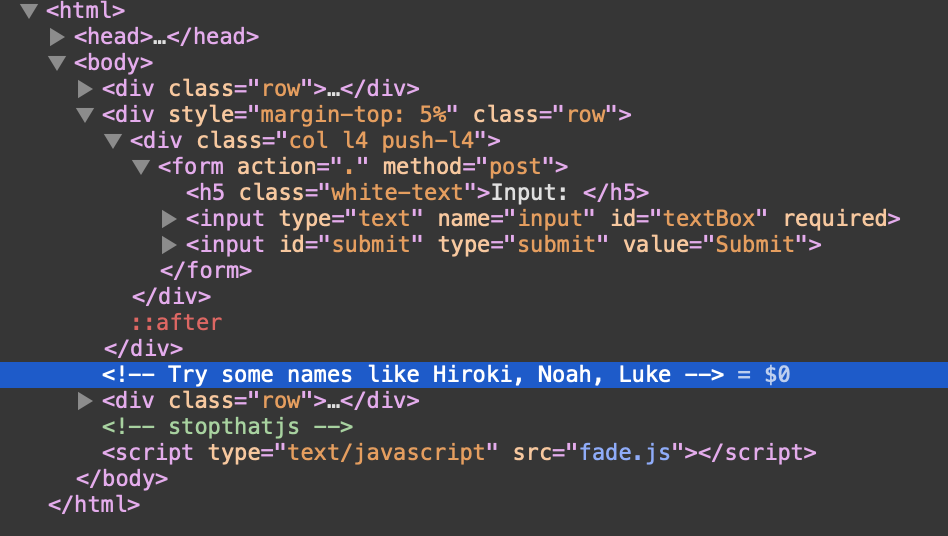
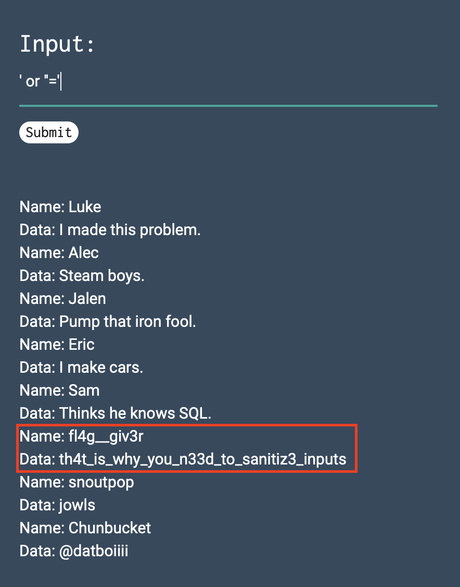

# CTFLearn 01 - Basic Injection
## Problem Statement
See if you can leak the whole database. The flag is in there somwhere… https://web.ctflearn.com/web4/

## Solution
There is a hint in the HTML source code. 

Usually such input & fetch uses a SQL statement something like
 
`SELECT * FROM table WHERE column=‘value’`

When `Luke` is given as input, we get a record with some information

So the following SQL is being executed

`SELECT * FROM table WHERE column=‘Luke’`

Our goal is to modify this query to return all the records, but we can only modify the query after the WHERE `column=‘`  part

One way to do that is to write a query like this

`SELECT * FROM table WHERE column=‘’ OR ‘’=‘’`

Solution: Type  `’ or ‘’=‘` in the input box to get all the records.

`th4t_is_why_you_n33d_to_sanitiz3_inputs` is the flag 
