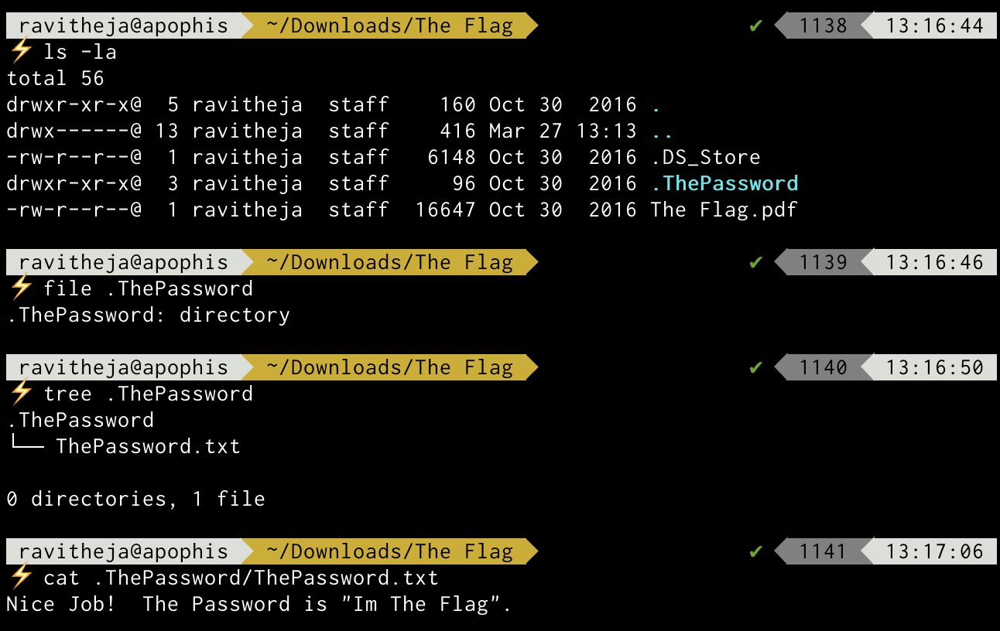
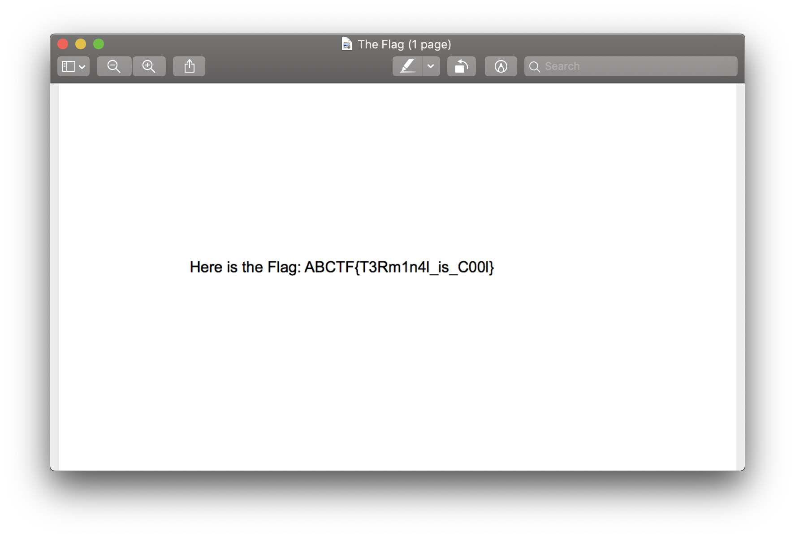

# CTFLearn 03 - Taking Ls
## Problem Statement
Just take the Ls. Check out this zip file and I be the flag will remain hidden. https://mega.nz/#!mCgBjZgB!_FtmAm8s_mpsHr7KWv8GYUzhbThNn0I8cHMBi4fJQp8

## Solution
The downloaded file is a compressed zip file. When extracted, it has a password protected PDF file. 

Using the `ls` command with the `-la` options will list the contents of the folder including hidden files.

The password can be found in a text file inside a hidden folder, Using the password, the encrypted PDF can be unlocked and it contains the flag we are looking for.

