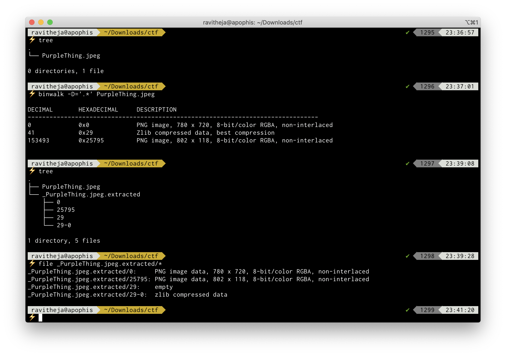
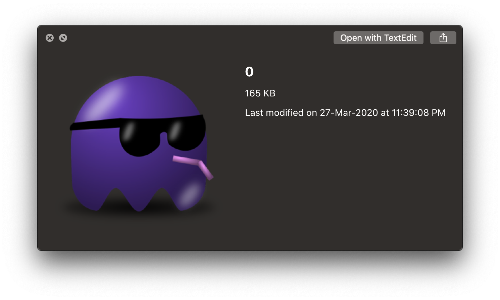
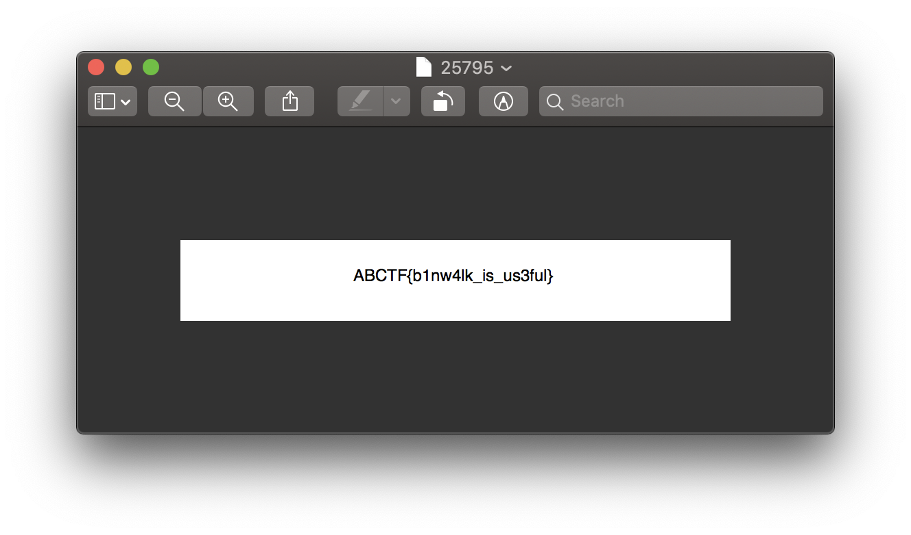

# CTFLearn 04 - Binwalk
## Problem Statement
Here is a file with another file hidden inside it. Can you extract it? https://mega.nz/#!qbpUTYiK!-deNdQJxsQS8bTSMxeUOtpEclCI-zpK7tbJiKV0tXYY

## Solution
The file downloaded from the above link is a jpeg image named PurpleThing.jpeg 

`binwalk` is a tool for searching binary images for embedded files and executable code.

The command `binwalk -D=‘.*’ PurpleThing.jpeg` will extract all file types that binwalk is able to identify

Using the `file` utility we can find out more about the extracted files, we have 2 PNG images, an empty file and a zlib compressed data file

Let’s inspect the images in the file explorer
The file `0` is the same image as `PurpleThing.jpeg`

`25795` contains the flag we are looking for, Voila!

