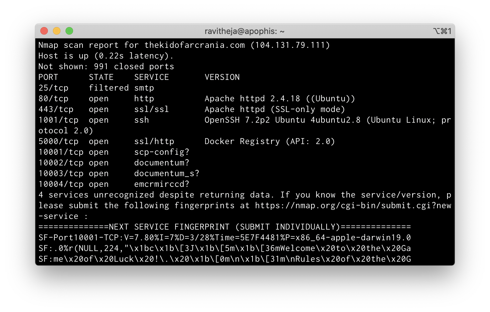
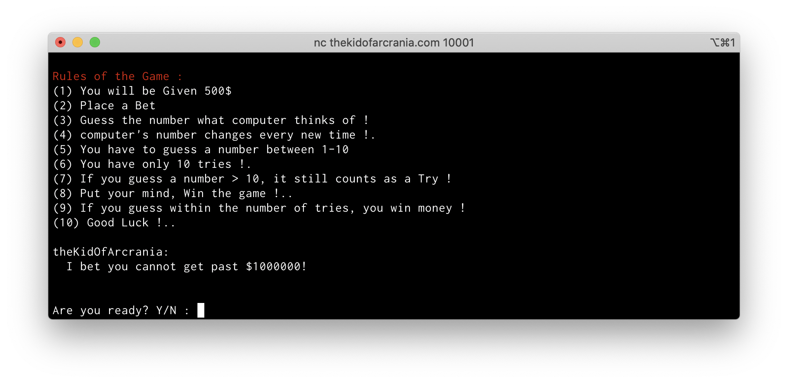
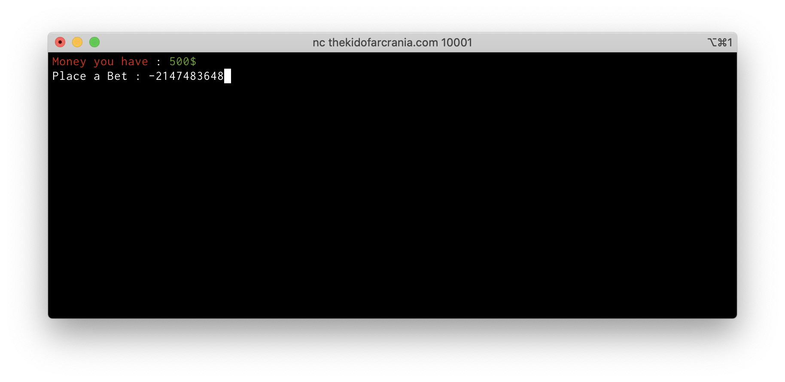
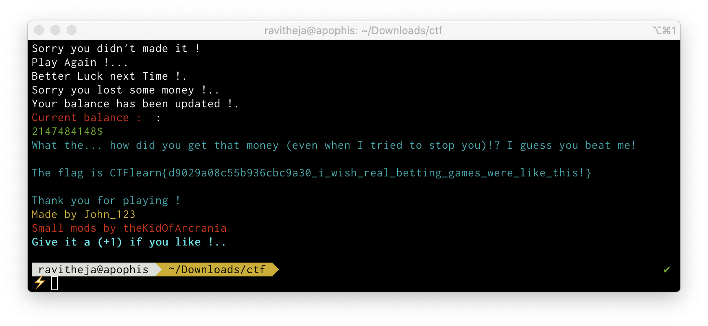

# CTFLearn 07 - Lazy Game Challenge
## Problem Statement
I found an interesting game made by some guy named “John_123”. It is some betting game. I made some small fixes to the game; see if you can still pwn this and steal $1000000 from me!
To get flag, pwn the server at: `nc thekidofarcrania.com 10001`

## Notes
Loading this website on the browser is infinitely auto-redirecting (probably to the same address) and is a dead end.

Doing a port scan using `nmap` shows a few open ports
 `nmap -sV thekidofarcrania.com`

The docker registry on port 5000 looks interesting

Upon connecting to `thekidofarcrania.com:10001` seems to be a HTTP/0.9 based web application.

## What is HTTP/0.9?
* HTTP/0.9 is a one-line protocol. Its main points are:
* Initial version of HTTP - a simple client-server, request-response, telnet friendly protocol.
* Request nature: single-line (method + path for requested document).
* Methods supported: GET only.
* Response type: hypertext only.
* Connection nature: terminated immediately after the response.
* No HTTP headers (cannot transfer other content type files), No status/error codes, No URLs, No versioning.

For details see the article
 [Evolution of HTTP — HTTP/0.9, HTTP/1.0, HTTP/1.1, Keep-Alive, Upgrade, and HTTPS](https://medium.com/platform-engineer/evolution-of-http-69cfe6531ba0) .

## Solution
Turns out it can be done with a number overflow 

The program doesn’t do any sort of negative number validation, so when a bet amount is entered, it just checks if it is less than the amount I have, when it should have instead been `input_amount > 0 && input_amount <= amount_i_have`

So given this, when `-2147483648` is entered as the bet amount and the number is wrongly guessed 10 times, it’s just subtracted from the amount we already have which will always result in a positive number.

`500 - (-2147483648) = 2147484148` which is greater than `1000000`

